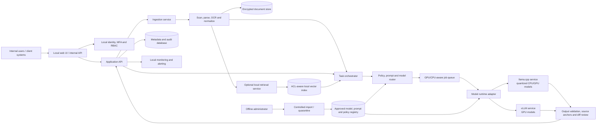

# Air-Gapped LLM Tool — Architecture and Implementation Plan

## 1. Purpose

Build an on-premises, air-gapped application that uses approved open-weight large language models to:

- summarize general text and documents;
- create structured summaries of science and technology material;
- produce topic-wise summaries from locally supplied newspaper headlines and editorial content;
- suggest grammar, formatting, and contextual-integrity improvements; and
- add future capabilities without coupling the product to one model or runtime.

The deployment must function with all external network routes blocked. News material is therefore **imported by an authorized user or an approved disconnected feed**; the system must not scrape the Internet.

## 2. Recommended delivery approach

Start with an evaluation-backed, single-node MVP rather than a broad catalogue of models. It should have one approved summarization model, one grammar/correction profile, robust document handling, and a controlled path to add models and task profiles later. This minimizes operational risk while proving usefulness on the organization’s real documents.

### Scope of release 1

| In scope | Deliberately deferred |
|---|---|
| Paste-text and PDF/DOCX/TXT uploads | Internet search, crawling, or cloud APIs |
| General, STEM, and news/editorial summaries | Fine-tuning/LoRA training on production content |
| Configurable length and formats: brief, bullets, detailed | Autonomous actions or external tool use |
| Grammar/reformat suggestions with a reviewable diff | Translation, speech, and chatbots unless separately approved |
| Source anchors, warnings, model/prompt provenance | Cross-document retrieval until users demonstrate the need |
| Local RBAC, audit, approved offline model import | Kubernetes/high-availability infrastructure for the pilot |

## 3. Architecture principles

1. **Offline by design.** Default-deny egress, no telemetry, no CDN assets, and no runtime dependency download.
2. **Model neutral.** The application calls a stable internal generation interface; local runtimes and approved models are interchangeable.
3. **Documents are untrusted.** Parse, OCR, and normalize inputs in a sandbox. Treat document text as data, never as operating instructions.
4. **Grounded output.** Preserve page/paragraph metadata, return source anchors where possible, preserve names/dates/numbers, and disclose extraction or confidence warnings.
5. **Human control for consequential work.** Grammar edits are suggestions with a diff; summaries carry an “AI-generated—verify against source” label.
6. **Governed expansion.** New models, prompt templates, and task profiles enter only through a signed, evaluated approval process.

## 4. Target reference architecture

### Core components

| Component | Responsibility | Key design decision |
|---|---|---|
| Web UI and internal API | Upload/paste text, submit jobs, show results/diffs, exports, job status | Static assets are bundled locally; use a versioned REST API with job progress events. |
| Identity and access | Local authentication, MFA/smart-card where available, role and classification controls | Roles: user, reviewer, administrator, auditor; preserve document ACLs through retrieval. |
| Ingestion | Validate file type/size, malware scan where mandated, parse PDF/DOCX/TXT/HTML, OCR scans | Execute parsers/OCR in a restricted container/process; record source hash, owner and classification. |
| Normalization | Extract text, language/structure/page metadata, chunk by sections and token budget | Retain page/paragraph anchors so results can cite the original. |
| Task orchestrator | Select workflow, generate chunk/map-reduce/final jobs, track retries and quotas | Long documents use hierarchical section summaries; never silently truncate input. |
| Policy/prompt router | Select approved task profile, prompt version, temperature, output schema and model | Keep task logic separate from the UI and model runtime. |
| Runtime adapter | Offer `generate`, `tokenize`, `health`, and `capabilities` across local runtimes | Start with llama.cpp for compact deployments; add vLLM for higher-throughput GPU nodes. |
| Output validator | Validate JSON/output format, check protected entities/numbers/dates, render corrections as a diff | It flags risk and missing evidence; it must not claim to prove factuality. |
| Storage | Encrypted document/artifact store plus PostgreSQL metadata/audit database | PostgreSQL for multi-user deployment; SQLite only for a single-user proof of concept. |
| Optional retrieval | Supply ACL-filtered context only for cross-document tasks | Do not add it to the first summarization MVP unless user workflows require it. |
| Model registry | Store approved weights, hashes, signatures, license, SBOM, model card, benchmarks and rollback version | No model is activated without an approved manifest and evaluation record. |
| Observability | Local-only health, latency, queue, resource, error and audit monitoring | Operational logs are redacted/minimal; full prompt logging is off by default. |

## 5. Key workflows

### A. Document or text summarization

1. Authenticate the user and check document/classification permissions.
2. Scan and sandbox-parse the input; retain the original hash and source metadata.
3. Split text by structure and token budget, retaining page/section anchors.
4. Use the appropriate profile: general, STEM, or news/editorial.
5. For long inputs, generate section summaries then a grounded final synthesis.
6. Validate output schema, detect risky changes to dates/numbers/named entities, attach anchors/warnings, and store reproducibility metadata.

### B. Grammar and contextual-integrity review

1. Use a low-creativity correction profile plus an offline grammar engine when useful.
2. Protect organization glossary terms, proper nouns, figures, units, dates, citations, and quotations.
3. Return suggestions as a before/after diff with an explanation category; the user accepts or rejects each change.
4. Flag ambiguous passages instead of silently rewriting meaning.

### C. Controlled model or software update

1. Authorized media enters a controlled import station.
2. Scan, quarantine, verify provenance, cryptographic hash/signature, license, SBOM, and offline vulnerability intelligence.
3. Validate in an isolated evaluation environment against regression, safety, performance, and prompt-injection tests.
4. Obtain security and business approval, deploy to a canary, and retain a known-good rollback artifact.

## 6. Deployment topology and sizing

### Pilot / small unit

One hardened Linux server with encrypted NVMe storage, local container registry/cache, and no Internet route. A practical baseline is 16+ CPU cores, 64 GB RAM, and fast storage. A recommended interactive configuration adds one 24 GB-class GPU and 128 GB RAM. Final hardware sizing must be based on a benchmark of approved models and target concurrency.

### Scale-out trigger

Separate stateless UI/API/orchestration services from GPU inference workers only when the pilot needs higher concurrency, isolation, or availability. Keep the import station, management/MLOps zone, audit/backup zone, and production inference zone separated by default-deny rules. Do not introduce Kubernetes until multiple inference nodes or HA requires it.

## 7. Implementation roadmap

| Phase | Indicative duration | Outcomes and exit gate |
|---|---:|---|
| 0. Discovery and governance | Weeks 1–2 | Confirm data classifications, retention, formats, languages, user roles, concurrent load and deployment sites. Benchmark 2–3 approved model/quantization candidates; create a sanitized, representative evaluation corpus and SME rubric. **Gate:** approved architecture, hardware choice, model shortlist, threat model, and acceptance criteria. |
| 1. Platform foundation | Weeks 2–4 | Establish offline build/release bundle, internal UI/API, local auth, encrypted storage, audit metadata, job queue, model adapter, model registry, and basic monitoring. **Gate:** air-gapped authenticated inference with model switching and an auditable request lifecycle. |
| 2. Secure MVP | Weeks 5–7 | Deliver paste-text and PDF/DOCX/TXT summarization, summary formats, grammar suggestions/diff, local news/editorial batch import, source anchors, and basic administration. **Gate:** all MVP user flows work with outbound routes blocked. |
| 3. Domain capability | Weeks 8–10 | Add STEM templates, terminology/acronym/unit preservation, long-document hierarchical summaries, OCR warnings, topic clustering/duplicate detection for news, batches/retries/quotas, and approved output formats. **Gate:** feature-complete regression results and documented model behavior. |
| 4. Hardening and readiness | Weeks 10–12 | Implement egress denial verification, encrypted data/traffic, secret management, access recertification, quarantine/import controls, DLP/export controls, backup/restore, offline update and incident runbooks. **Gate:** restore drill passes and no unresolved critical/high security issues remain. |
| 5. Pilot and handover | Weeks 13–16 | Run UAT, load/capacity/security tests, install from a signed offline bundle, train users/admins, run a controlled pilot and two weeks of hypercare. **Gate:** formal business, security and operations acceptance. |

The timeline assumes hardware and security decisions are available early. Several streams can run in parallel, but model evaluation and data-governance approval should not be skipped.

## 8. Evaluation and acceptance plan

Create a versioned, held-out internal corpus of general, STEM, news/editorial, long-form, OCR-noisy, and—if required—English/Hindi examples. All model, prompt, and runtime changes are evaluated against it before release.

| Area | Evidence / proposed acceptance condition |
|---|---|
| Summarization | Measure factual claim support, critical-fact omission, hallucination, citation coverage, compression, and SME usefulness. A proposed initial gate is at least 90% sampled factual claim support; tune it with SMEs before production. |
| STEM | Measure terminology, acronym, number, unit, equation, title and reference preservation. Set an SME-backed target, recommended at 95%+ for protected technical terms. |
| News/editorials | Test topic, timeline, entity, attribution and fact-versus-opinion accuracy. |
| Grammar | Measure correction precision, harmful-edit rate, meaning preservation and grammatical acceptability; require a reviewable diff. |
| Offline/privacy | Prove zero external calls during install, startup, inference and update; prove that uploads never cross the deployment boundary. |
| Security | Test RBAC/classification isolation, hostile file uploads, prompt injection, artifact signatures, export controls and audit coverage. Unauthorized retrieval is a zero-tolerance failure. |
| Operations | Test p95 latency, throughput, queue behavior, CPU/GPU memory, restart, model rollback, disk-full and backup/restore behavior on production-equivalent hardware. |

## 9. Security, privacy and operational controls

- Use default-deny network controls; disable unmanaged radios/removable media and prohibit model services from executing tools or code.
- Encrypt documents, indexes, backups, and model packages at rest; store keys in approved TPM/HSM-backed or equivalent local key management.
- Run services as non-root with read-only/minimal images, resource limits, signed dependencies and no outbound network access.
- Enforce least privilege, MFA, classification-aware RBAC/ABAC, dual approval for sensitive administrative/model actions, and break-glass auditing.
- Treat PDF, Office, OCR and retrieval documents as hostile: scan, normalize, sandbox, hash originals, apply provenance, and adversarially test prompt injection.
- Use minimal, redacted operational logs. Record immutable audit events for login, import/export, retrieval, inference metadata, model/prompt changes and approvals.
- Do not train on production prompts/documents by default. Any fine-tuning needs a separate data approval, sanitization and memorization-risk review.
- Maintain runbooks for document import, offline updates, suspected data leak/unsafe output, media/access incidents, backup/restore and model rollback.

## 10. Team and governance

A lean build team is 7–9 full-time equivalents: technical architect/delivery lead; 1–2 ML/inference engineers; 2 backend/document-processing engineers; frontend/UX engineer; DevSecOps/offline deployment engineer; and 1–2 QA/evaluation engineers. Security, infrastructure, legal/compliance, and STEM/news subject-matter experts should be continuously available part-time.

Establish an AI governance board with delivery, security, privacy, operations, legal/compliance and domain representatives. It approves data classes, model and prompt changes, release gates, incident closure, and authority to operate.

## 11. Decisions required before Phase 1

1. Security classification and whether data classes must be physically or logically separated.
2. Supported input formats, languages, maximum document size/context, output/export formats, retention, and deletion requirements.
3. Expected concurrent users and response-time/capacity objectives; this determines GPU and model selection.
4. Available local identity system (for example, AD/LDAP) and MFA requirements.
5. Whether newspaper content arrives as PDFs, text, OCR scans, or an approved internal feed.
6. Whether cross-document search/retrieval is genuinely needed in release 1.
7. Approval authority and media-handling process for model, dependency, and security updates.

## 12. First 10 working days

1. Run a requirements, data-classification, and threat-model workshop.
2. Collect a sanitized evaluation set and define expert scoring instructions.
3. Inventory target infrastructure and benchmark candidate models on it.
4. Select the pilot model/runtime/hardware baseline and record the decision.
5. Define input/output schemas, source-anchor format, task profiles, and audit fields.
6. Set up the offline artifact/import pipeline and prove the no-egress network policy.
7. Prototype the complete text-to-summary path before expanding document formats or task types.

