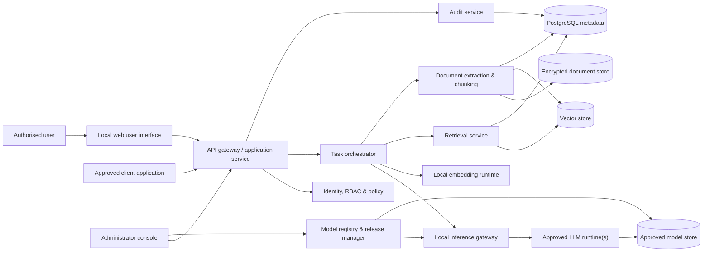
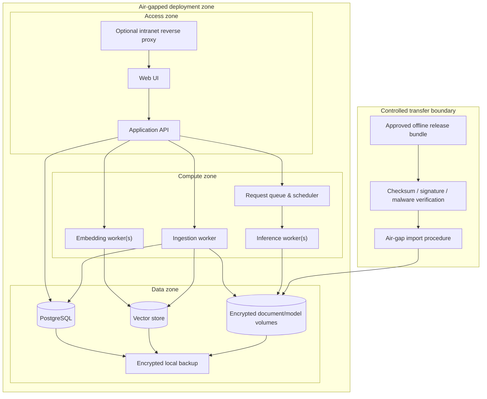
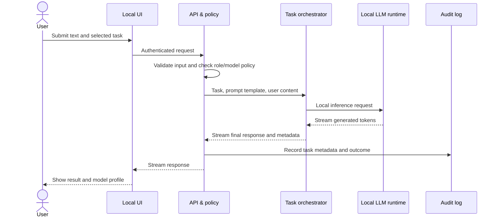
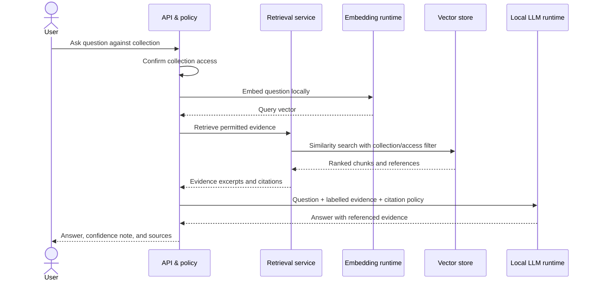
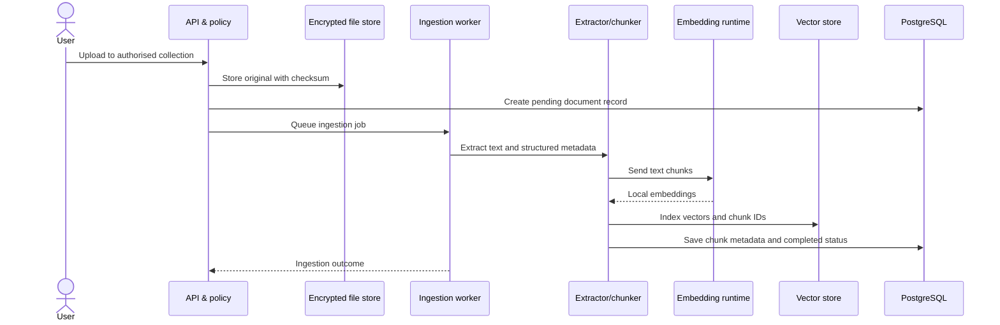
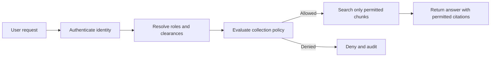

# System Architecture — Air-Gapped LLM Assistant

## 1. Architectural Goals

The architecture supports a secure local assistant for a network disconnected from the internet. It is designed to be:

- **Air-gapped:** no required or permitted runtime internet connection.
- **Private:** prompts, documents, embeddings, model outputs, and logs stay inside the deployment boundary.
- **Modular:** LLMs, embedding models, retrieval stores, and inference runtimes can be replaced without changing client workflows.
- **Grounded:** document-based responses cite the local evidence used.
- **Scalable:** begin on one host and expand to separate service, inference, and data nodes.
- **Auditable:** security-relevant user and administrator actions are recorded locally.

## 2. Logical Architecture



The web UI and any approved client communicate only with the application API. The API is responsible for authentication, authorisation, rate limits, input validation, task routing, and audit-event creation. Client applications do not directly access model files, the vector database, or raw document storage.

## 3. Deployment Boundary



No arrow leaves the air-gapped deployment zone. Firewall and host policy must deny outbound traffic by default. The controlled transfer procedure is the only route for approved application updates, model files, and imported content.

## 4. Components and Responsibilities

| Component | Responsibility | Must not do |
|---|---|---|
| Web UI | Chat, upload, document/collection management, source display, admin screens | Hold database credentials or communicate directly with models |
| API gateway | Session handling, RBAC, validation, request IDs, rate limits, response streaming | Make external network requests |
| Task orchestrator | Select prompt template, retrieve authorised context, invoke model, assemble cited response | Bypass access policy |
| Inference gateway | Route requests to an active local model profile; manage worker capacity and cancellation | Download, update, or activate unapproved models |
| LLM runtime | Run the selected local model and return generated tokens | Access raw document collections without retrieved context |
| Embedding runtime | Create vectors for chunks and user queries | Send vectors to hosted APIs |
| Retrieval service | Filter by access policy, rank chunks, provide source metadata | Return unauthorised document fragments |
| Ingestion worker | Validate imports, extract text, chunk, embed, index, report status | Make imported content executable |
| Model registry | Record approved model versions, format, checksum, resource profile, status | Fetch models online |
| Audit service | Create immutable or append-only security and operations events | Store sensitive content beyond policy |

## 5. Request Flows

### 5.1 General assistant, rewrite, or supplied-text summary



### 5.2 Grounded question over a document collection



The prompt given to the model must clearly label retrieved passages as untrusted reference data. The model is instructed to answer only from this evidence when the task is a grounded query, and to state when evidence is insufficient.

### 5.3 Document ingestion



## 6. Model Lifecycle and Compatibility

Each model is represented by a versioned **model profile**, not a hard-coded application dependency. A profile contains:

- Model family, version, parameter count, licence, and intended task class.
- Artifact path, format (GGUF/Safetensors), quantisation, checksum, and approval ID.
- Inference-runtime version and launch configuration.
- Context window, maximum output, supported languages, and hardware requirements.
- Evaluation scorecard, known limitations, date approved, owner, and rollback predecessor.

Model activation follows this workflow:

1. Receive the approved model artifact through the controlled transfer process.
2. Verify checksum/signature and register it as `staged`.
3. Run a local smoke test and the fixed evaluation suite.
4. An authorised administrator promotes it to `active` for a named hardware profile.
5. The inference gateway drains existing requests and reloads or routes new requests to the new profile.
6. Record activation in the audit log; retain the preceding profile for rollback.

## 7. Data Classification and Access Control

Every document collection, conversation, and export has a classification and access policy. Retrieval occurs after authorisation, not before.



Suggested roles:

| Role | Capabilities |
|---|---|
| User | Chat, process supplied text, query and upload only to permitted collections |
| Collection steward | Manage access rules and lifecycle for assigned collections |
| Model operator | Stage/activate approved models and review performance/health |
| Security auditor | Read audit events and configuration history, without routine document access |
| System administrator | Operate infrastructure, backups, identity integration, and upgrades |

## 8. Storage Architecture

| Store | Contents | Protection |
|---|---|---|
| PostgreSQL | Users, roles, sessions, document metadata, collection policy, jobs, audit metadata | Encryption at rest, least-privilege database roles, backups |
| Encrypted file/object volume | Original imports, extracted artefacts where retained, model artifacts, release bundles | Volume encryption, checksum validation, strict filesystem permissions |
| Vector store | Chunk vectors, chunk IDs, collection IDs, source positions | Co-located inside air gap, access only through retrieval service |
| Local log store | Structured service and security logs | Rotation, restricted access, configured retention, no external shipping |
| Backup store | Encrypted snapshots and recovery media | Offline/segmented copy, restoration tests, retention policy |

An embedding can reveal information about its source and must be classified and protected at the same level as the underlying document content.

## 9. Security Architecture

### Network controls

- Default-deny egress at the host, container, and network perimeter.
- No browser CDNs, hosted fonts, telemetry, analytics, package downloaders, or model hubs in production.
- TLS for all connections crossing a host boundary; optional mutual TLS for service-to-service links in multi-node deployments.
- Expose only the reverse-proxy/API port to the approved intranet segment.

### Application controls

- Integrate with an approved local identity provider when available; otherwise use hardened local accounts with password policy and MFA where feasible.
- Issue short-lived sessions/tokens, enforce rate limits, validate uploads, and apply file-size/type quotas.
- Encrypt sensitive configuration/secrets and rotate them using the organisation’s approved process.
- Use CSRF protection, secure cookies, content-security policy, and server-side authorisation checks.
- Treat all uploaded and retrieved document text as untrusted. It can never override system policy or cause command/tool execution.

### Supply-chain controls

- Create releases in a controlled build environment.
- Transfer only approved images, packages, models, and configuration through a documented intake process.
- Deliver an SBOM, licences, hashes, and release manifest with every bundle.
- Pin component versions; disable automatic updates and remote discovery.

## 10. Scalability Topologies

### Single-host pilot

Use one server with containers for UI/API, PostgreSQL, vector store, ingestion, and one inference runtime. This topology is suitable for evaluation and small user groups; it simplifies operations but does not provide high availability.

### Departmental deployment

Separate GPU inference from the application/data host. The API queues requests and forwards them to one or more local inference workers. Run ingestion asynchronously so indexing does not affect interactive chat latency.

### Enterprise deployment

Run stateless UI/API instances behind an intranet load balancer, a pool of GPU inference workers, dedicated PostgreSQL/vector nodes, and a segmented backup service. Schedule model workers according to GPU memory, model profile, and classification boundary. Introduce redundancy only after the single-host workflow is accepted and measured.

## 11. Resilience and Operations

- All services expose local liveness/readiness checks; `/health` provides an aggregated, access-controlled operational summary.
- A request queue applies user quotas, cancellation, backpressure, and fair scheduling when inference capacity is saturated.
- Database migrations are versioned, reversible where practical, and tested in a staging instance.
- Back up metadata, document contents, vector indexes, model registry, configuration, and encryption-key recovery material according to policy.
- Test restoration regularly into an isolated host; a backup is not accepted until it has been restored successfully.
- Keep an approved rollback deployment bundle and previous active model profile.

## 12. Non-Functional Targets to Establish During Discovery

| Area | Target definition |
|---|---|
| Availability | Service uptime target and allowed maintenance window for the selected topology |
| Responsiveness | Time to first token, tokens/second, and completion latency by model/hardware profile |
| Capacity | Concurrent interactive users, queued requests, documents, chunks, and retained conversations |
| Recovery | Recovery point objective (RPO) and recovery time objective (RTO) |
| Quality | Human-reviewed task score and citation-grounding rate on the local evaluation corpus |
| Security | No outbound runtime connectivity; no unauthorised collection retrieval in validation tests |
| Maintainability | Time and procedure required to install a signed offline update and roll it back |

The final numeric targets should be agreed after representative workload and hardware are available; they should not be inferred from model parameter counts alone.

## 13. Recommended Repository Layout

```text
offline-llm-assistant/
├── apps/
│   ├── web/                    # React/TypeScript local UI
│   └── api/                    # FastAPI application and task orchestration
├── services/
│   ├── ingestion/              # Extraction, chunking and indexing workers
│   ├── inference/              # Runtime adapters and model-profile loader
│   └── retrieval/              # Retrieval and citation assembly
├── packages/
│   ├── contracts/              # API schemas and shared types
│   └── prompts/                # Versioned task templates and policies
├── infrastructure/
│   ├── compose/                # Single-host deployment manifests
│   ├── ansible-or-scripts/     # Offline installation automation
│   └── monitoring/             # Local dashboards and alert rules
├── docs/
│   ├── security/
│   ├── operations/
│   └── evaluation/
├── tests/
│   ├── integration/
│   ├── security/
│   └── evaluation/
└── release/                    # Manifests only; never commit model weights or secrets
```

## 14. Architectural Decisions Summary

| Decision | Rationale |
|---|---|
| Local inference only | Meets the requirement for a network-disconnected solution and prevents data egress |
| Model abstraction layer | Supports multiple open-weight models and controlled future upgrades |
| RAG with source citations | Improves factual grounding and supports verifiability for document work |
| Separate ingestion pipeline | Keeps document processing asynchronous and isolates untrusted files from interactive requests |
| PostgreSQL plus vector store | Separates transactional policy/metadata needs from semantic search |
| Offline release bundle | Makes upgrades repeatable while preserving the air-gap boundary |
| RBAC before retrieval | Prevents vector search or context assembly from exposing unauthorised data |
| Single host first, scale later | Provides a practical deployment path while retaining a clear route to higher capacity |

